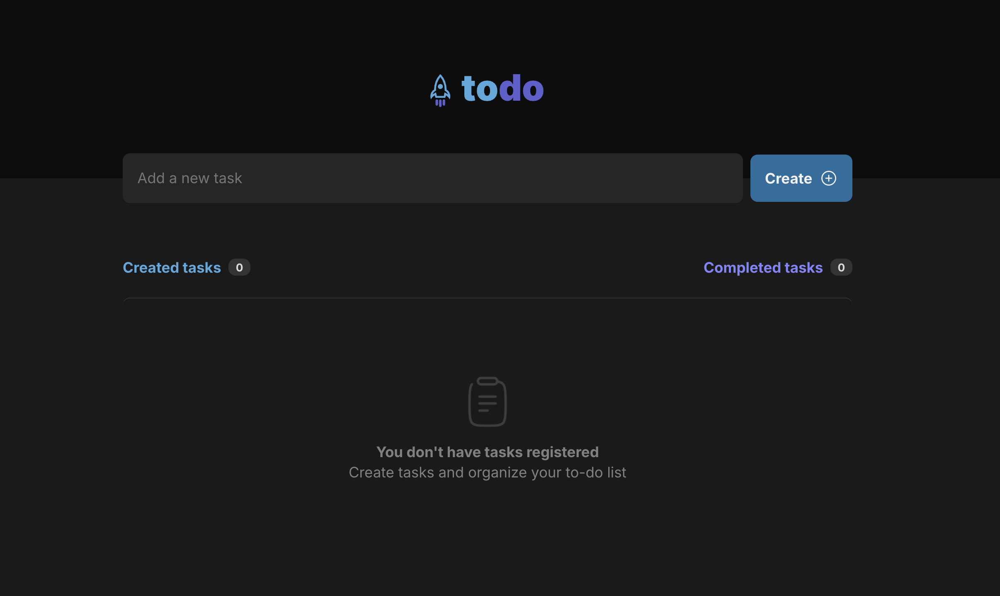
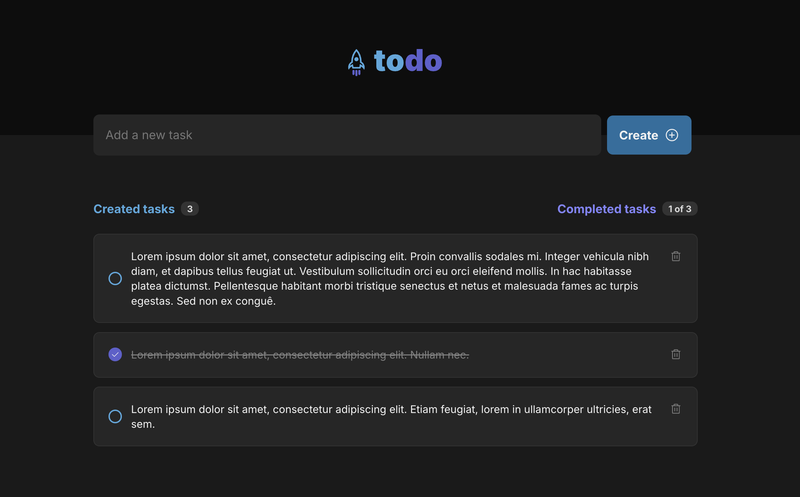

# Todo List Application

A sleek and responsive **Todo List Application** built with **React.js** and **TypeScript**

---

## 🚀 Features

- 📝 **Add, Edit, and Delete Todos**: Full CRUD operations for task management.
- 📂 **Persistent State**: Saves tasks using modern state management techniques.
- 📱 **Responsive Design**: Works seamlessly across desktops, tablets, and mobile devices.
- ⚡ **Fast and Lightweight**: Built with Vite for superior performance.
- 🛠️ **TypeScript Integration**: Ensures type safety and scalable code.

---

## 🛠️ Technologies Used

- **React.js**: Component-based library for building user interfaces.
- **TypeScript**: Enhances JavaScript with type definitions for robust development.
- **Vite**: Modern build tool for fast development and production builds.
- **CSS Modules**: Scoped and modular CSS for styling.
- **ESLint**: Linting for code quality and consistency.

---


## 📂 Project Structure

    
    02-TodoList-reactjs/
    ├── public/              # Static assets
    ├── src/                 # Source code
    │   ├── components/      # Reusable components
    │   ├── styles/          # CSS styles
    │   ├── App.tsx          # Main application entry
    │   └── main.tsx         # React entry point
    ├── package.json         # Project dependencies and scripts
    ├── tsconfig.json        # TypeScript configuration
    └── vite.config.ts       # Vite configuration

---
## ⚙️ Installation and Usage

### Prerequisites
- Node.js (v16 or later)
- npm or Yarn

### Setup
1. Clone the repository:
   ```bash
   git clone https://github.com/your-username/02-TodoList-reactjs.git
   cd 02-TodoList-reactjs

2.	Install dependencies:
    ```bash
    npm install

3.	Start the development server:
    ```bash
    npm run dev

4.	Open your browser at http://localhost:5173.

5.	Build for production:
    ```bash
    npm run build

6.	Preview the production build locally:
    ```bash
    npm run Preview

## 🖼️ Screenshots

### App in Action



